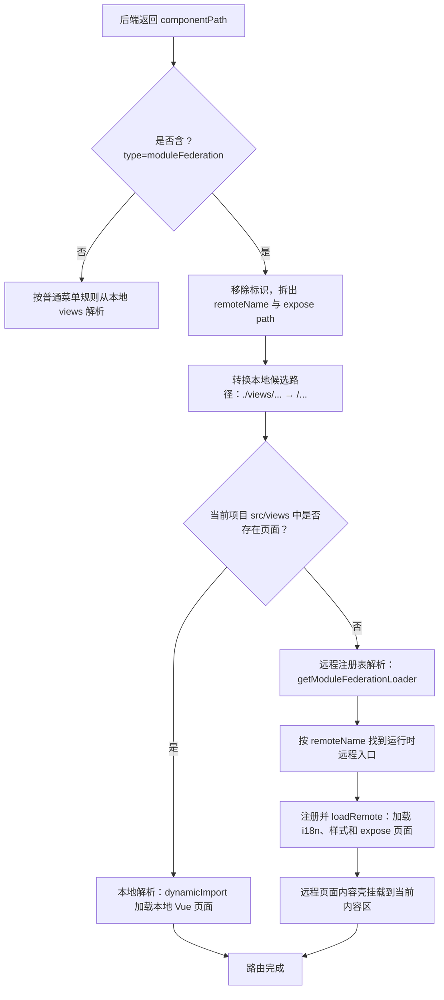

# 路由与菜单规范

## 一、路由分层

```text
staticRoutes  → 登录、OAuth、401、404等无需后端菜单的页面
dynamicRoutes → 首页、个人中心等本地补充路由
后端菜单路由 → 正式业务菜单，本地页面或模块联邦远程页面
```

布局路由来自 `aura-core/theme-core/layout/index.vue`。业务页面不要自行创建第二套路由器、权限守卫或主布局。

## 二、本地开发路由

新页面需要脱离后端菜单快速验证时，可临时加入 `src/router/route.ts` 的 `dynamicRoutes`：

```ts
{
	path: '/order/list',
	name: 'orderList',
	component: () => import('/@/views/order/list/index.vue'),
	meta: {
		title: '订单管理',
		isKeepAlive: true,
	},
}
```

正式联调后由后端菜单接管的临时条目应删除，避免同一页面存在两个权限入口。

## 三、本地页面菜单

本地页面的 `componentPath` 必须与 `src/views` 下文件对应，具体是否带 `/views` 前缀以菜单接口既有约定为准；前端最终会通过 Vite 的页面模块集合解析。

示例文件：

```text
src/views/order/list/index.vue
```

建议菜单配置：

```text
path: /order/list
componentPath: /order/list/index
```

页面找不到时先核对大小写、目录、入口文件和菜单缓存，不要通过复制页面或增加模糊路径兜底。

## 四、模块联邦菜单：后台配置与解析规则

模块联邦页面仍由后端菜单控制。在菜单管理中新增或编辑菜单时，按下列方式填写；截图中红框的“带参”和“组件”是识别模块联邦页面的关键字段。

### 菜单管理界面示意图


图中红框表示模块联邦菜单的必填配置：选择“带参”为“是”，并在“组件”中完整填写 `componentPath`。示例中的组件值为 `/aura-license-center/views/license/files/index.vue?type=moduleFederation`。

| 菜单字段 | 授权文件管理示例 | 说明 |
| --- | --- | --- |
| 类型 | 菜单 | 与普通业务页面一致。 |
| 菜单名称 | 授权文件管理 | 用于侧边栏和标签页标题。 |
| 路由 | `/license/files` | 当前综合端内的访问地址；不填写远程部署地址。 |
| 带参 | 是 | `componentPath` 含有 `?type=moduleFederation`，必须开启带参，保证该标识被保存和返回。 |
| 组件 | `/aura-license-center/views/license/files/index.vue?type=moduleFederation` | 模块联邦页面定位串，必须完整填写。 |

其他字段（上级菜单、排序、图标、显示、缓存、权限标识）按普通菜单业务规则填写。`componentPath` 不是浏览器要直接访问的 URL，浏览器访问的是“路由”字段；前端根据 `componentPath` 决定加载哪个 Vue 页面。

### 1. 组件字段逐段解释

```text
/aura-license-center/views/license/files/index.vue?type=moduleFederation
│ └─────────────────────────────────┬─────────────────────────────────┘
│                                   │
│                                   └─ 模块联邦解析标识
└─ 提供方 remoteName + expose path
```

| 片段 | 示例值 | 含义 |
| --- | --- | --- |
| 开头 `/` | `/` | 路径分隔符，不属于名称。 |
| 提供方名称 | `aura-license-center` | 提供授权中心页面的综合端 `remoteName`，必须与提供方 `currentRemoteConfig.remoteName` 完全一致且在部署环境中唯一。它不是 `remoteEntryName`，也不是项目目录名或域名。 |
| expose 路径 | `views/license/files/index.vue` | 提供方暴露的页面路径，对应 expose key `./views/license/files/index.vue`。 |
| 解析标识 | `?type=moduleFederation` | 告知菜单路由转换器按模块联邦规则处理。它是前端加载标识，不是传给业务页面的业务查询参数；不能省略、不能改名。 |

因此，上例要求授权中心提供方存在以下配置：

```ts
export const currentRemoteConfig = {
	remoteName: 'aura-license-center',
	remoteEntryName: 'auraLicenseCenter',
	// 其他配置省略
};

export const pageExposes = {
	'./views/license/files/index.vue': './src/views/license/files/index.vue',
};
```

错误示例：

```text
/auraLicenseCenter/views/license/files/index.vue?type=moduleFederation
```

错误原因：第一段错误使用了 `remoteEntryName`。`remoteEntryName` 用于部署和开发代理前缀；菜单第一段必须是 `remoteName`。

### 2. 本项目访问与远程消费的两条解析链路

模块联邦菜单带有统一标识，但不会一开始就强制请求远程。当前模板的后端菜单转换逻辑会先尝试本地页面，再通过远程注册表加载，流程如下。



以授权中心菜单为例：

```text
componentPath: /aura-license-center/views/license/files/index.vue?type=moduleFederation
本地候选路径: /license/files/index
远程模块 ID: aura-license-center/views/license/files/index.vue
```

- 授权中心项目自身访问该菜单时，`src/views/license/files/index.vue` 存在，优先走本地解析；不会请求自身的 `mf-manifest.json`。
- 其他综合端消费授权中心时，本地没有该页面，前端会以原始 `componentPath` 到模块联邦远程注册表查找加载器，解析出 `aura-license-center` 和 `./views/license/files/index.vue`，再从配置的远程入口加载页面。

本地优先是当前模板的既定行为。因此，消费方如果希望加载远程授权中心页面，不能在自身创建同名文件 `src/views/license/files/index.vue`；否则会被本地页面抢先解析。

### 3. 消费授权中心远程页面的最小配置

消费方必须把提供方加入运行时远程清单，名称与菜单第一段保持一致：

```ts
export const moduleFederationRemoteNames = ['aura-core', 'aura-license-center'] as const;

export const moduleFederationRemoteEntries = {
	'aura-core': import.meta.env.VITE_AURA_CORE_REMOTE_PATH,
	'aura-license-center': import.meta.env.VITE_AURA_LICENSE_CENTER_REMOTE_PATH,
};
```

```dotenv
VITE_AURA_LICENSE_CENTER_REMOTE_PATH=/auraLicenseCenter/mf-manifest.json
```

远程入口、开发代理和发布目录可以使用 `remoteEntryName`（示例为 `auraLicenseCenter`）；菜单 `componentPath` 仍只能使用 `remoteName`（示例为 `aura-license-center`）。完整的代理、i18n、样式和失败重试配置见[模块联邦开发技术规范](./模块联邦开发技术规范.md#三引入远程模块)。

### 4. 菜单配置检查

- [ ] “路由”填写当前业务访问路径，“组件”填写完整 `componentPath`，两者没有混用。
- [ ] 模块联邦页面的“带参”已选“是”。
- [ ] `componentPath` 第一段等于提供方 `remoteName`，而非 `remoteEntryName`。
- [ ] `componentPath` 剩余路径等于提供方 expose key 去掉开头的 `.`。
- [ ] `?type=moduleFederation` 完整保留，未拼接业务查询参数或改写标识名称。
- [ ] 提供方自身可本地打开页面；消费方没有同名本地页面，且运行时远程名称、入口已配置。

## 五、动态加载与静态 import

```text
后端菜单动态页面 → 运行时 remote names + entries + 环境变量 + 开发代理
源码静态 import  → 上述配置 + Vite 编译期 remotes + TypeScript 声明
```

只有源码实际写了下列 import 时，才加入编译期 remote：

```ts
import OrderStatusTag from 'aura-order-web/components/OrderStatusTag.vue';
```

不要因为一个后端动态菜单页面就增加编译期 remote，避免启动阶段形成不必要的远程依赖。

## 六、路由 meta

常用字段以当前 `RouteItem` 类型和后端菜单模型为准：

- `title`：菜单或标签标题。
- `icon`：菜单图标。
- `isHide`：是否隐藏菜单。
- `isKeepAlive`：是否缓存页面。
- `isAffix`：是否固定标签。
- `isLink`：是否外链。
- `isIframe`：是否 iframe 页面。
- `isModuleFederationRemote`：前端解析远程菜单后写入，业务菜单无需手工配置。

隐藏详情页优先通过后端菜单权限模型或明确的本地子路由实现，不把任意 URL 参数拼成未授权页面。

## 七、检查清单

- [ ] 正式业务入口由后端菜单管理，没有遗留重复临时路由。
- [ ] 本地页面路径与 `src/views` 文件一致。
- [ ] 远程菜单第一段等于提供方 `remoteName`。
- [ ] 远程菜单剩余路径等于 expose key 去掉开头的 `.`。
- [ ] 模块联邦菜单已开启“带参”，并完整保留 `?type=moduleFederation`。
- [ ] 消费方不存在与目标远程页面同名的本地文件，避免本地优先解析遮蔽远程页面。
- [ ] 动态页面没有误加编译期 remote。
- [ ] 静态 import 已补编译期 remote 和类型声明。
- [ ] 页面刷新、标签缓存、权限和 404 行为正常。

完整配置见[模块联邦开发技术规范](./模块联邦开发技术规范.md)。
